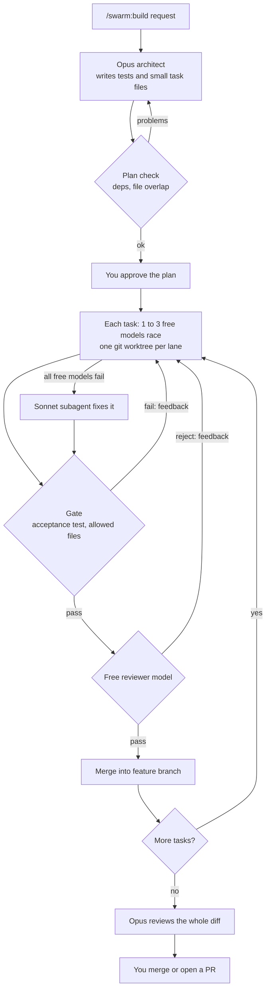

# swarm

A Claude Code plugin that builds features with free models doing the typing.

Opus plans the work once. Free [opencode](https://opencode.ai) models write and review the code. A shell script runs the tests, so no model's "done" is taken on trust.

## Why

- **Cheaper.** Claude tokens go to one plan and one final review. The coding in between runs on free-tier models.
- **Still checked.** Every task must pass an acceptance test that Opus wrote and the coder cannot edit.
- **Safe to try.** Work lands on its own branch. Your checked-out branch is untouched until you merge or open a PR.

## How it works



Your Claude Code session (Sonnet) only dispatches tasks and reads one-line results; it never reads the code.

## Install

You need Claude Code, [opencode](https://opencode.ai) v2 signed in (`opencode auth login`), `git`, and `jq`. macOS or Linux.

```
/plugin marketplace add mobashirrahman/claude-code-agent-swarm
/plugin install swarm@claude-code-agent-swarm
/swarm:doctor
```

## Use

In a git repository with at least one commit:

```
/swarm:build add a slugify helper with tests
```

| Command | What it does |
|---|---|
| `/swarm:build <request>` | Plan, build, and review a feature |
| `/swarm:resume [feature]` | Continue a build that was interrupted |
| `/swarm:stats [feature]` | Pass rates per model, rate limits, escalations |
| `/swarm:doctor` | Check that opencode and the models are usable |

If your tests need installed dependencies, add the install command to a `swarm.config.json` at your repository root, since each task starts in a fresh worktree:

```json
{ "worktree": { "setup": ["npm ci"] } }
```

## Good to know

- Free model line-ups and rate limits change. `/swarm:doctor` reports models that are gone, and rate-limited models are skipped automatically.
- The coder runs unattended with shell access inside its worktree. The limits on it are a guardrail, not a sandbox.
- Free providers may log what they are sent. Check their terms before using this on private code.

Configuration, the task file format, and safety details are in [docs/reference.md](docs/reference.md).

## Benchmarks

Coming.
