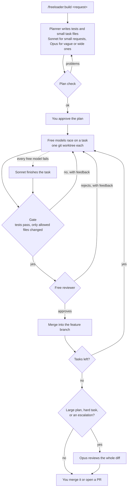

# freeloader

[](https://github.com/mobashirrahman/freeloader/actions/workflows/ci.yml)
[](LICENSE)
[](https://docs.claude.com/en/docs/claude-code/plugins)

**Claude plans. Free models code. Tests decide.**

freeloader is a Claude Code plugin that hands the typing to free models. Claude breaks a feature into small tasks and writes the tests. Free models on [opencode](https://opencode.ai) race to implement each task. A shell script runs the tests and merges only what passes.

It started as a way to spend fewer Claude tokens. I then measured it, and the honest answer so far is below.

## Does it save anything?

Not on small tasks. I ran six requests, from a one-function helper to a query-language parser, through plain Claude Code and through freeloader, and scored each result with hidden tests that no session saw.

| | Tasks solved | Claude cost | Wall time |
|---|---|---|---|
| Sonnet alone | 6 of 6 | $0.76 | 3 min |
| Opus alone | 6 of 6 | $1.93 | 6 min |
| freeloader 1.0.0 | 6 of 6 | $4.11 | 44 min |
| freeloader 1.1.0 | 5 of 5 finished | $0.91 | 13 min |

What that says:

- **The free models can do the work.** Across both versions they passed every hidden test on every build that finished, without one task being handed back to Claude.
- **1.0.0 cost five times more than just asking Sonnet.** Writing the code was never the expensive part. An Opus plan, an Opus review, and a session coordinating it all cost far more than the code they produced.
- **1.1.0 removed most of that.** Sonnet plans small requests, Opus reviews only when a plan is large or something went wrong, and the whole plan runs in one call. Cost on the five comparable tasks fell from $2.82 to $0.91, against $0.58 for Sonnet alone.
- **It is still slower, and still not cheaper than Sonnet** at this size. It is cheaper than Opus alone.

The sixth 1.1.0 run is left out of that row. It hit a bug that the benchmark itself uncovered, where a stalled model was never timed out on macOS. That is fixed in 1.1.0 and the run is being repeated.

Where this might pay off is work where the code is large compared with the description of it, which none of these tasks were. That is the next thing to measure. The full tables, the method, and the caveats are in [bench/](bench/README.md).

## How it works



Your Claude Code session is the orchestrator. It starts the build with one command and reads one result. It never reads the code.

## The idea

Small free models are fast and often good enough, but you cannot trust them. They say "done" when the code does not run, they edit the test instead of fixing the bug, and they wander into files nobody asked them to touch.

freeloader does not try to make them trustworthy. It assumes they are not, and puts the judgement somewhere else:

- **The tests come from Claude.** The planner writes the acceptance tests before any coder starts. They are committed first, and an edit to them by a coder is thrown away.
- **A script decides, not a model.** A task is finished when its test command exits 0 and only the files it was allowed to change have changed. Nobody's opinion is involved.
- **Models compete.** Up to three free models work on the same task at once, each in its own git worktree. The first one through the gate wins, so one model having a bad day does not hold anything up.
- **Failure is cheap.** A failed attempt gets the error output and tries again. If every free model gives up, a Sonnet subagent finishes the task, and its work goes through the same gate.

## Quick start

You need [Claude Code](https://claude.com/claude-code), [opencode](https://opencode.ai) v2 with `opencode auth login` done, `git`, and `jq`. It runs on macOS and Linux.

Install the plugin from inside Claude Code:

```
/plugin marketplace add mobashirrahman/freeloader
/plugin install freeloader@freeloader
```

Then, in any git repository with at least one commit:

```
/freeloader:doctor
/freeloader:build add a slugify helper with tests
```

You are shown the plan and asked once whether to go ahead. Everything is built on a branch called `freeloader/<feature>/main`, so your own branch is left alone until you merge it or ask for a pull request.

If your tests need installed dependencies, say how to install them. Each task starts in a fresh worktree:

```json
{ "worktree": { "setup": ["npm ci"] } }
```

Save that as `freeloader.config.json` in the root of your repository.

## Commands

| Command | What it does |
|---|---|
| `/freeloader:build <request>` | Plan, build, and review a feature |
| `/freeloader:resume [feature]` | Pick up a build that was interrupted |
| `/freeloader:stats [feature]` | Pass rate, rate limits, and timing for each model |
| `/freeloader:doctor` | Check that opencode and the configured models are usable |

## What a run looks like

Each task leaves a one-line result behind, and the build reports all of them at once:

```json
{"status":"pass","feature":"discounts","passed":2,"total":2,"review":"skip",
 "tasks":[{"id":"001-types","status":"pass","model":"opencode/muse-spark-1.3-contributor-free","attempts":1},
          {"id":"002-total","status":"pass","model":"opencode/muse-spark-1.3-contributor-free","attempts":1}]}
```

That is from the benchmark's discounts task: two tasks planned by Sonnet, both passed by a free model on the first attempt, 24 of 24 hidden tests passing, $0.23 of Claude usage.

## Things it handles for you

- **Rate limits.** Free tiers are small. A model that returns a 429 or refuses the request is skipped for half an hour and the next one takes over.
- **Documentation lookups.** Coders can fetch web pages, so they can read a library's docs instead of guessing at its API.
- **Parallel work.** Tasks that do not depend on each other run at the same time. The plan is checked first so that two of them never edit the same file, and a merge that breaks the combined code is rolled back.
- **Interruptions.** Plans, results, and branches live on disk. Close the session, come back later, and `/freeloader:resume` carries on from the tasks that are left.
- **Picking models.** Every attempt is recorded. Models with a better record in your repository are tried first, and `/freeloader:stats` shows you the numbers.
- **Hard tasks.** The planner marks each task easy, normal, or hard. Harder tasks get more models racing, and you can point hard ones at a stronger model of your choice.

Configuration, the task file format, and every script are described in [docs/reference.md](docs/reference.md).

## Limits

Worth knowing before you rely on it:

- **It is not a sandbox.** Coders run unattended with a shell and web fetch inside their worktree. They are denied writes outside it and commands like `git push` and `curl`, but those rules are a guardrail. See [SECURITY.md](SECURITY.md).
- **It depends on someone else's free tier.** opencode decides what its free models will serve, and it has been tightening that. freeloader skips a model that refuses and carries on, and you can point it at paid models instead, but free capacity is not guaranteed.
- **Your code leaves your machine.** Free providers may log or train on what they are sent. Check their terms before using this on private code.
- **It is not a way to save money yet.** See the benchmark above.
- **It is slow.** Free models take minutes where Claude takes seconds, and one stalled call can cost a quarter of an hour before it is timed out.
- **Tests are the ceiling.** A coder can still write code that passes the visible tests and nothing else. The reviewer and, on larger plans, the Opus pass look for that, but nothing mechanical stops it yet.
- **Free line-ups change.** The default models are whatever opencode offered for free when this was written. `/freeloader:doctor` tells you when one is gone.

## Roadmap

- Benchmark larger features, where coding is a bigger share of the work, to find where this breaks even
- Held-out tests that the coder never sees
- Windows without WSL

## Development

The task runner is plain bash and has an end-to-end test suite that needs no model access. A stand-in replaces opencode, and each test drives the real scripts against a throwaway git repository.

```
tests/run.sh
```

CI runs the suite on Linux and macOS. See [CONTRIBUTING.md](CONTRIBUTING.md) for how the code is laid out.

## License

[MIT](LICENSE)
